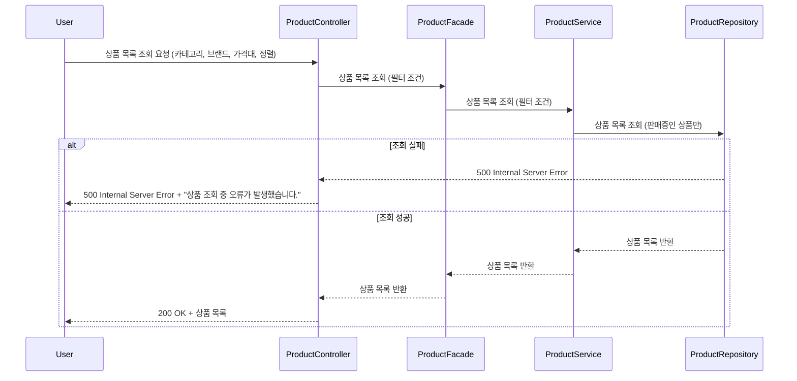
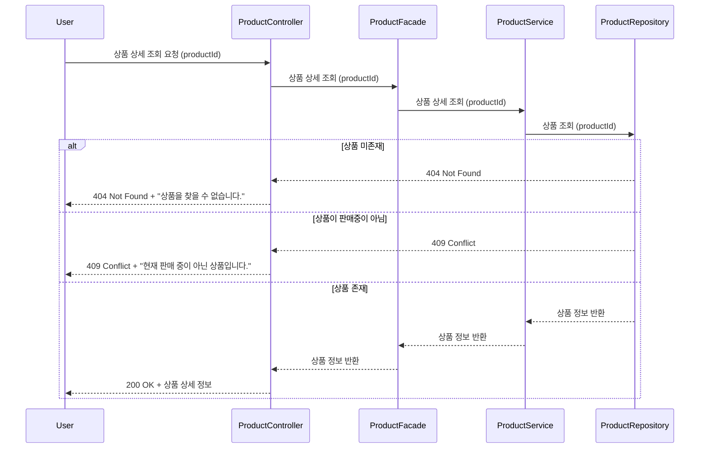
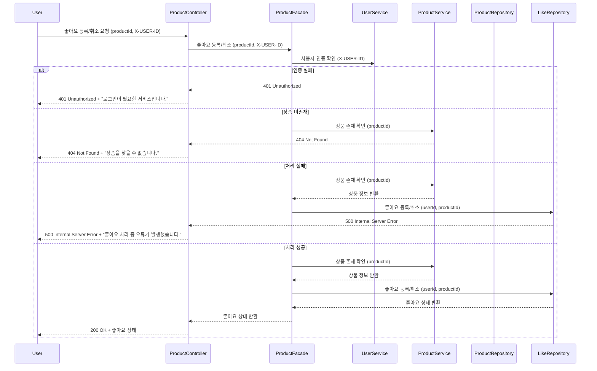
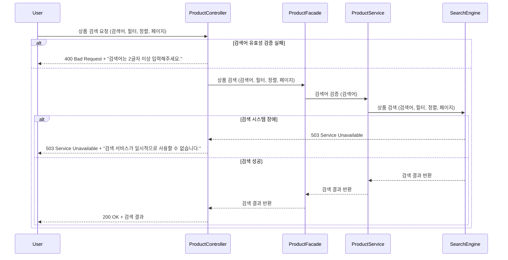
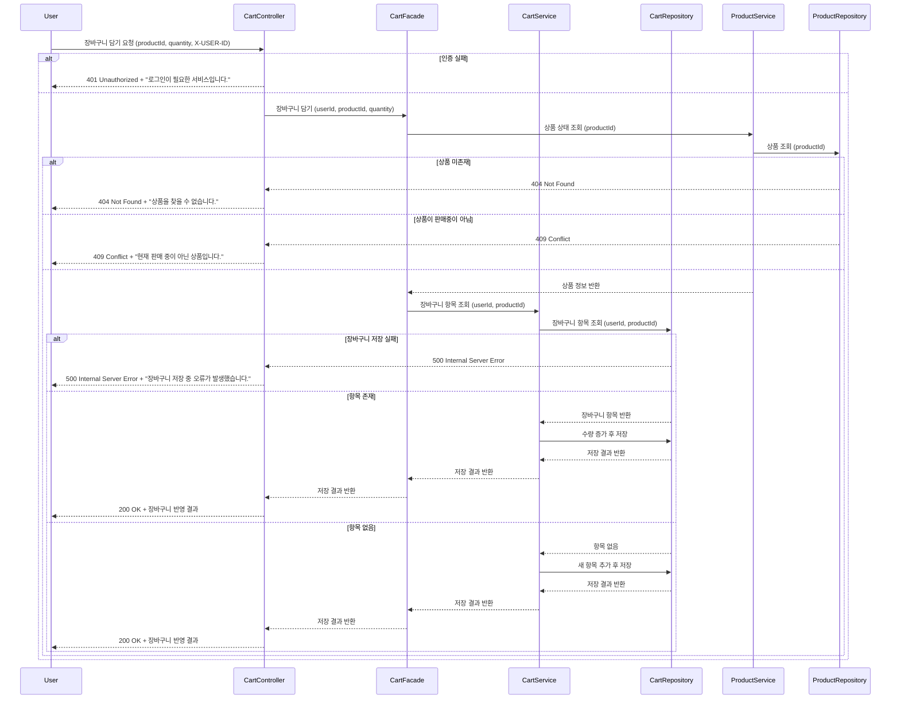
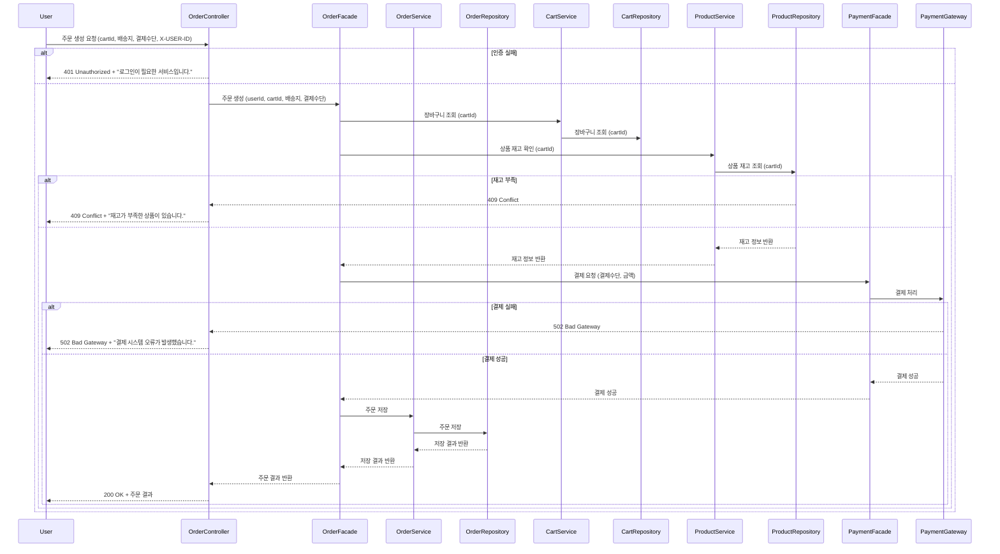

# 시퀀스 다이어그램

## 상품 / 브랜드

### 상품 목록 조회

```mermaid
sequenceDiagram
    participant U as User
    participant PC as ProductController
    participant PF as ProductFacade
    participant PS as ProductService
    participant PR as ProductRepository

    U->>PC: 상품 목록 조회 요청 (카테고리, 브랜드, 가격대, 정렬)
    
    PC->>PF: 상품 목록 조회 (필터 조건)
    PF->>PS: 상품 목록 조회 (필터 조건)
    PS->>PR: 상품 목록 조회 (판매중인 상품만)
    
    alt 조회 실패
        PR-->>PC: 500 Internal Server Error
        PC-->>U: 500 Internal Server Error + "상품 조회 중 오류가 발생했습니다."
    else 조회 성공
        PR-->>PS: 상품 목록 반환
        PS-->>PF: 상품 목록 반환
        PF-->>PC: 상품 목록 반환
        PC-->>U: 200 OK + 상품 목록
    end
```

### 상품 정보 조회

```mermaid
sequenceDiagram
    participant U as User
    participant PC as ProductController
    participant PF as ProductFacade
    participant PS as ProductService
    participant PR as ProductRepository

    U->>PC: 상품 상세 조회 요청 (productId)
    
    PC->>PF: 상품 상세 조회 (productId)
    PF->>PS: 상품 상세 조회 (productId)
    PS->>PR: 상품 조회 (productId)
    
    alt 상품 미존재
        PR-->>PC: 404 Not Found
        PC-->>U: 404 Not Found + "상품을 찾을 수 없습니다."
    else 상품이 판매중이 아님
        PR-->>PC: 409 Conflict
        PC-->>U: 409 Conflict + "현재 판매 중이 아닌 상품입니다."
    else 상품 존재
        PR-->>PS: 상품 정보 반환
        PS-->>PF: 상품 정보 반환
        PF-->>PC: 상품 정보 반환
        PC-->>U: 200 OK + 상품 상세 정보
    end
```

### 상품 좋아요 등록/취소

```mermaid
sequenceDiagram
    participant U as User
    participant PC as ProductController
    participant PF as ProductFacade
    participant US as UserService
    participant PS as ProductService
    participant PR as ProductRepository
    participant LR as LikeRepository

    U->>PC: 좋아요 등록/취소 요청 (productId, X-USER-ID)
    
    PC->>PF: 좋아요 등록/취소 (productId, X-USER-ID)
    PF->>US: 사용자 인증 확인 (X-USER-ID)
    
    alt 인증 실패
        US-->>PC: 401 Unauthorized
        PC-->>U: 401 Unauthorized + "로그인이 필요한 서비스입니다."
    else 상품 미존재
        PF->>PS: 상품 존재 확인 (productId)
        PS-->>PC: 404 Not Found
        PC-->>U: 404 Not Found + "상품을 찾을 수 없습니다."
    else 처리 실패
        PF->>PS: 상품 존재 확인 (productId)
        PS-->>PF: 상품 정보 반환
        PF->>LR: 좋아요 등록/취소 (userId, productId)
        LR-->>PC: 500 Internal Server Error
        PC-->>U: 500 Internal Server Error + "좋아요 처리 중 오류가 발생했습니다."
    else 처리 성공
        PF->>PS: 상품 존재 확인 (productId)
        PS-->>PF: 상품 정보 반환
        PF->>LR: 좋아요 등록/취소 (userId, productId)
        LR-->>PF: 좋아요 상태 반환
        PF-->>PC: 좋아요 상태 반환
        PC-->>U: 200 OK + 좋아요 상태
    end
```

### 상품 검색

```mermaid
sequenceDiagram
    participant U as User
    participant PC as ProductController
    participant PF as ProductFacade
    participant PS as ProductService
    participant SE as SearchEngine

    U->>PC: 상품 검색 요청 (검색어, 필터, 정렬, 페이지)
    
    alt 검색어 유효성 검증 실패
        PC-->>U: 400 Bad Request + "검색어는 2글자 이상 입력해주세요."
    else
        PC->>PF: 상품 검색 (검색어, 필터, 정렬, 페이지)
        PF->>PS: 검색어 검증 (검색어)
        PS->>SE: 상품 검색 (검색어, 필터, 정렬, 페이지)
        alt 검색 시스템 장애
            SE-->>PC: 503 Service Unavailable
            PC-->>U: 503 Service Unavailable + "검색 서비스가 일시적으로 사용할 수 없습니다."
        else 검색 성공
            SE-->>PS: 검색 결과 반환
            PS-->>PF: 검색 결과 반환
            PF-->>PC: 검색 결과 반환
            PC-->>U: 200 OK + 검색 결과
        end
    end
```

## 장바구니

### 장바구니 담기

```mermaid
sequenceDiagram
    participant U as User
    participant CC as CartController
    participant CF as CartFacade
    participant CS as CartService
    participant CR as CartRepository
    participant PS as ProductService
    participant PR as ProductRepository

    U->>CC: 장바구니 담기 요청 (productId, quantity, X-USER-ID)
    
    alt 인증 실패
        CC-->>U: 401 Unauthorized + "로그인이 필요한 서비스입니다."
    else
        CC->>CF: 장바구니 담기 (userId, productId, quantity)
        CF->>PS: 상품 상태 조회 (productId)
        PS->>PR: 상품 조회 (productId)
        alt 상품 미존재
            PR-->>CC: 404 Not Found
            CC-->>U: 404 Not Found + "상품을 찾을 수 없습니다."
        else 상품이 판매중이 아님
            PR-->>CC: 409 Conflict
            CC-->>U: 409 Conflict + "현재 판매 중이 아닌 상품입니다."
        else
            PS-->>CF: 상품 정보 반환
            CF->>CS: 장바구니 항목 조회 (userId, productId)
            CS->>CR: 장바구니 항목 조회 (userId, productId)
            alt 장바구니 저장 실패
                CR-->>CC: 500 Internal Server Error
                CC-->>U: 500 Internal Server Error + "장바구니 저장 중 오류가 발생했습니다."
            else 항목 존재
                CR-->>CS: 장바구니 항목 반환
                CS->>CR: 수량 증가 후 저장
                CR-->>CS: 저장 결과 반환
                CS-->>CF: 저장 결과 반환
                CF-->>CC: 저장 결과 반환
                CC-->>U: 200 OK + 장바구니 반영 결과
            else 항목 없음
                CR-->>CS: 항목 없음
                CS->>CR: 새 항목 추가 후 저장
                CR-->>CS: 저장 결과 반환
                CS-->>CF: 저장 결과 반환
                CF-->>CC: 저장 결과 반환
                CC-->>U: 200 OK + 장바구니 반영 결과
            end
        end
    end
```

## 주문 / 결제

### 주문 생성

```mermaid
sequenceDiagram
    participant U as User
    participant OC as OrderController
    participant OF as OrderFacade
    participant OS as OrderService
    participant OR as OrderRepository
    participant CS as CartService
    participant CR as CartRepository
    participant PS as ProductService
    participant PR as ProductRepository
    participant PF as PaymentFacade
    participant PG as PaymentGateway

    U->>OC: 주문 생성 요청 (cartId, 배송지, 결제수단, X-USER-ID)
    
    alt 인증 실패
        OC-->>U: 401 Unauthorized + "로그인이 필요한 서비스입니다."
    else
        OC->>OF: 주문 생성 (userId, cartId, 배송지, 결제수단)
        OF->>CS: 장바구니 조회 (cartId)
        CS->>CR: 장바구니 조회 (cartId)
        OF->>PS: 상품 재고 확인 (cartId)
        PS->>PR: 상품 재고 조회 (cartId)
        alt 재고 부족
            PR-->>OC: 409 Conflict
            OC-->>U: 409 Conflict + "재고가 부족한 상품이 있습니다."
        else
            PR-->>PS: 재고 정보 반환
            PS-->>OF: 재고 정보 반환
            OF->>PF: 결제 요청 (결제수단, 금액)
            PF->>PG: 결제 처리
            alt 결제 실패
                PG-->>OC: 502 Bad Gateway
                OC-->>U: 502 Bad Gateway + "결제 시스템 오류가 발생했습니다."
            else 결제 성공
                PG-->>PF: 결제 성공
                PF-->>OF: 결제 성공
                OF->>OS: 주문 저장
                OS->>OR: 주문 저장
                OR-->>OS: 저장 결과 반환
                OS-->>OF: 저장 결과 반환
                OF-->>OC: 주문 결과 반환
                OC-->>U: 200 OK + 주문 결과
            end
        end
    end
```

