# 클래스 다이어그램

## 전체 도메인 모델

```mermaid
classDiagram
    %% 상품 도메인
    class Product {
        +Long id
        +String name
        +String description
        +BigDecimal price
        +ProductStatus status
        +Brand brand
        +Category category
        +Integer stockQuantity
        
        +changeStatus(ProductStatus status)
        +updateStock(Integer quantity)
        +isAvailable()
        +calculatePriceWithOption(ProductOption option)
    }

    class ProductStatus {
        <<enumeration>>
        ON_SALE
        SOLD_OUT
        DISCONTINUED
    }

    class Brand {
        +Long id
        +String name
        +String description
        +String logoUrl
    }

    class Category {
        +Long id
        +String name
        +String description
        +Category parent
    }

    class ProductOption {
        +Long id
        +Product product
        +String optionType
        +String optionValue
        +BigDecimal additionalPrice
        +Integer stockQuantity
        
        +updateStock(Integer quantity)
        +isAvailable()
        +getTotalPrice()
    }

    class Inventory {
        +Long id
        +Product product
        +ProductOption productOption
        +Integer quantity
        +Integer reservedQuantity
        
        +reserve(Integer quantity)
        +release(Integer quantity)
        +getAvailableQuantity()
        +updateQuantity(Integer quantity)
    }

    %% 좋아요 도메인
    class Like {
        +Long id
        +User user
        +Long targetId
        +LikeType targetType
    }

    class LikeType {
        <<enumeration>>
        PRODUCT
        BRAND
    }

    %% 장바구니 도메인
    class Cart {
        +Long id
        +User user
        +List<CartItem> items
        
        +addItem(CartItem item)
        +removeItem(Long itemId)
        +updateQuantity(Long itemId, Integer quantity)
        +clear()
        +calculateTotal()
        +getItemCount()
    }

    class CartItem {
        +Long id
        +Product product
        +ProductOption productOption
        +Integer quantity
        +BigDecimal unitPrice
        
        +updateQuantity(Integer quantity)
        +calculateTotal()
        +isValid()
    }

    %% 주문 도메인
    class Order {
        +Long id
        +User user
        +List<OrderItem> items
        +OrderStatus status
        +BigDecimal totalAmount
        +BigDecimal deliveryFee
        +DeliveryAddress deliveryAddress
        +LocalDateTime orderDate
        
        +place()
        +cancel()
        +changeStatus(OrderStatus status)
        +calculateTotal()
        +canCancel()
        +canChangeDeliveryAddress()
    }

    class OrderStatus {
        <<enumeration>>
        PENDING_PAYMENT
        PAYMENT_COMPLETED
        PREPARING_SHIPMENT
        SHIPPING
        DELIVERED
        CANCELLED
    }

    class OrderItem {
        +Long id
        +Product product
        +ProductOption productOption
        +Integer quantity
        +BigDecimal unitPrice
        +BigDecimal totalPrice
        
        +calculateTotal()
        +isValid()
    }

    %% 결제 도메인
    class Payment {
        +Long id
        +Order order
        +PaymentMethod method
        +PaymentStatus status
        +BigDecimal amount
        +String transactionId
        +LocalDateTime paymentDate
        
        +process()
        +refund()
        +changeStatus(PaymentStatus status)
        +isCompleted()
        +canRefund()
    }

    class PaymentMethod {
        <<enumeration>>
        CREDIT_CARD
        POINT
        CREDIT_CARD_AND_POINT
    }

    class PaymentStatus {
        <<enumeration>>
        PENDING
        COMPLETED
        FAILED
        CANCELLED
    }

    %% 배송 도메인
    class DeliveryAddress {
        +Long id
        +User user
        +String recipientName
        +String phoneNumber
        +String zipCode
        +String address1
        +String address2
        +Boolean isDefault
        
        +setAsDefault()
        +updateAddress(String address1, String address2)
        +isValid()
        +getFullAddress()
    }

    %% 포인트 도메인
    class Point {
        +Long id
        +BigDecimal balance
        
        +earn(BigDecimal amount)
        +use(BigDecimal amount)
        +getBalance()
        +hasEnough(BigDecimal amount)
    }

    class PointHistory {
        +Long id
        +User user
        +PointHistoryType type
        +BigDecimal amount
        +BigDecimal balanceAfter
        +String description
        +Long relatedId
        
        +create(PointHistoryType type, BigDecimal amount, String description)
        +isUse()
    }

    class PointHistoryType {
        <<enumeration>>
        EARN
        USE
        EXPIRE
        REFUND
    }

    Product --> "1" ProductStatus
    Product --> "1" Brand
    Product --> "1" Category
    Product --> "N" ProductOption
    Product --> "N" CartItem
    Product --> "N" OrderItem
    Product --> "N" Like
    Product --> "N" Inventory

    Category --> "N" Product

    Cart --> "N" CartItem
    Order --> "N" OrderItem
    Order --> "1" DeliveryAddress

    ProductOption --> "N" CartItem
    ProductOption --> "N" OrderItem
    ProductOption --> "N" Inventory

    Like --> "1" LikeType
    Payment --> "1" PaymentMethod
    Payment --> "1" PaymentStatus
    PointHistory --> "1" PointHistoryType
```

## 도메인별 세부 설명

### 상품 도메인
- **Product**: 상품 기본 정보 (이름, 가격, 상태 등)
- **ProductStatus**: 상품 판매 상태 (판매중, 품절, 판매중단)
- **Brand**: 브랜드 정보
- **Category**: 상품 카테고리 (계층 구조 지원)
- **ProductOption**: 상품 옵션 (사이즈, 색상 등)
- **Inventory**: 상품별 재고 정보 (예약 재고 포함)

### 좋아요 도메인
- **Like**: 사용자별 좋아요 정보 (상품, 브랜드 등 확장 가능)
- **LikeType**: 좋아요 대상 타입

### 장바구니 도메인
- **Cart**: 사용자별 장바구니
- **CartItem**: 장바구니에 담긴 상품 정보

### 주문 도메인
- **Order**: 주문 기본 정보
- **OrderStatus**: 주문 상태
- **OrderItem**: 주문에 포함된 상품 정보
- **DeliveryAddress**: 배송지 정보

### 결제 도메인
- **Payment**: 결제 정보
- **PaymentMethod**: 결제 수단
- **PaymentStatus**: 결제 상태

### 포인트 도메인
- **Point**: 사용자 포인트 잔액
- **PointHistory**: 포인트 변동 이력
- **PointHistoryType**: 포인트 변동 타입 
