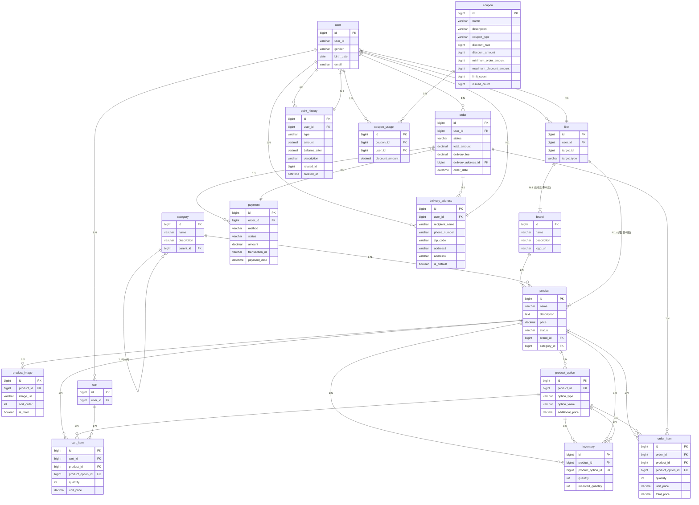

```mermaid
erDiagram
    user {
        bigint id PK
        varchar user_id
        varchar gender
        date birth_date
        varchar email
    }
    
    brand {
        bigint id PK
        varchar name
        varchar description
        varchar logo_url
    }
    
    category {
        bigint id PK
        varchar name
        varchar description
        bigint parent_id FK
    }
    
    product {
        bigint id PK
        varchar name
        text description
        decimal price
        varchar status
        bigint brand_id FK
        bigint category_id FK
    }
    
    product_image {
        bigint id PK
        bigint product_id FK
        varchar image_url
        int sort_order
        boolean is_main
    }
    
    product_option {
        bigint id PK
        bigint product_id FK
        varchar option_type
        varchar option_value
        decimal additional_price
    }
    
    inventory {
        bigint id PK
        bigint product_id FK
        bigint product_option_id FK
        int quantity
        int reserved_quantity
    }
    
    like {
        bigint id PK
        bigint user_id FK
        bigint target_id
        varchar target_type
    }
    
    cart {
        bigint id PK
        bigint user_id FK
    }
    
    cart_item {
        bigint id PK
        bigint cart_id FK
        bigint product_id FK
        bigint product_option_id FK
        int quantity
        decimal unit_price
    }
    
    order {
        bigint id PK
        bigint user_id FK
        varchar status
        decimal total_amount
        decimal delivery_fee
        bigint delivery_address_id FK
        datetime order_date
    }
    
    order_item {
        bigint id PK
        bigint order_id FK
        bigint product_id FK
        bigint product_option_id FK
        int quantity
        decimal unit_price
        decimal total_price
    }
    
    payment {
        bigint id PK
        bigint order_id FK
        varchar method
        varchar status
        decimal amount
        varchar transaction_id
        datetime payment_date
    }
    
    delivery_address {
        bigint id PK
        bigint user_id FK
        varchar recipient_name
        varchar phone_number
        varchar zip_code
        varchar address1
        varchar address2
        boolean is_default
    }
    
    point_history {
        bigint id PK
        bigint user_id FK
        varchar type
        decimal amount
        decimal balance_after
        varchar description
        bigint related_id
        datetime created_at
    }

    coupon {
        bigint id PK
        varchar name
        varchar description
        varchar coupon_type
        bigint discount_rate
        bigint discount_amount
        bigint minimum_order_amount
        bigint maximum_discount_amount
        bigint limit_count
        bigint issued_count
    }
    
    coupon_usage {
        bigint id PK
        bigint coupon_id FK
        bigint user_id FK
        decimal discount_amount
    }

    user ||--o{ cart : "1:N"
    user ||--o{ like : "1:N"
    user ||--o{ order : "1:N"
    user ||--o{ delivery_address : "1:N"
    user ||--o{ point_history : "1:N"
    user ||--o{ coupon_usage : "1:N"
    
    coupon ||--o{ coupon_usage : "1:N"
    product ||--o{ inventory : "1:N"
    product_option ||--o{ inventory : "1:N"
    brand ||--o{ product : "1:N"
    category ||--o{ product : "1:N"
    category ||--o{ category : "1:N (self)"
    product ||--o{ product_image : "1:N"
    product ||--o{ product_option : "1:N"
    product ||--o{ inventory : "1:N"
    product ||--o{ cart_item : "1:N"
    product ||--o{ order_item : "1:N"
    product_option ||--o{ inventory : "1:N"
    product_option ||--o{ cart_item : "1:N"
    product_option ||--o{ order_item : "1:N"
    cart ||--o{ cart_item : "1:N"
    order ||--o{ order_item : "1:N"
    order ||--o{ payment : "1:1"
    order ||--o{ delivery_address : "N:1"
    like ||--|{ user : "N:1"
    like ||--|{ product : "N:1 (상품 좋아요)"
    like ||--|{ brand : "N:1 (브랜드 좋아요)"
    payment ||--|{ order : "N:1"
    delivery_address ||--|{ user : "N:1"
    point_history ||--|{ user : "N:1"
```