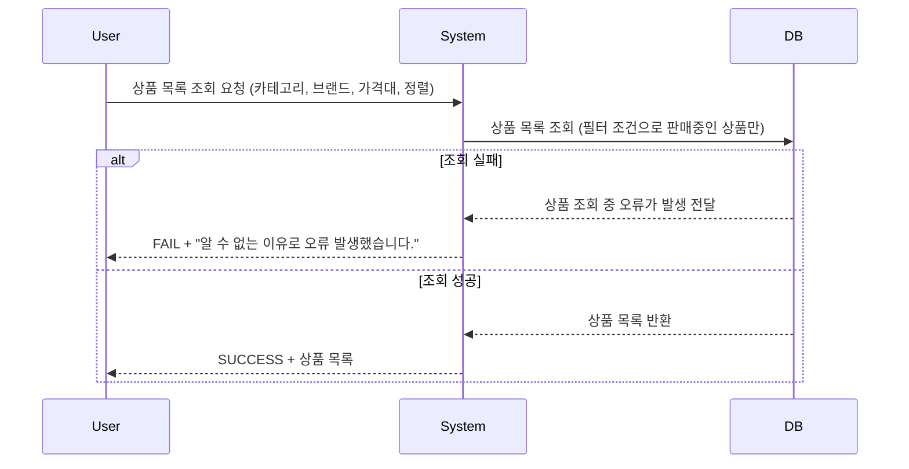
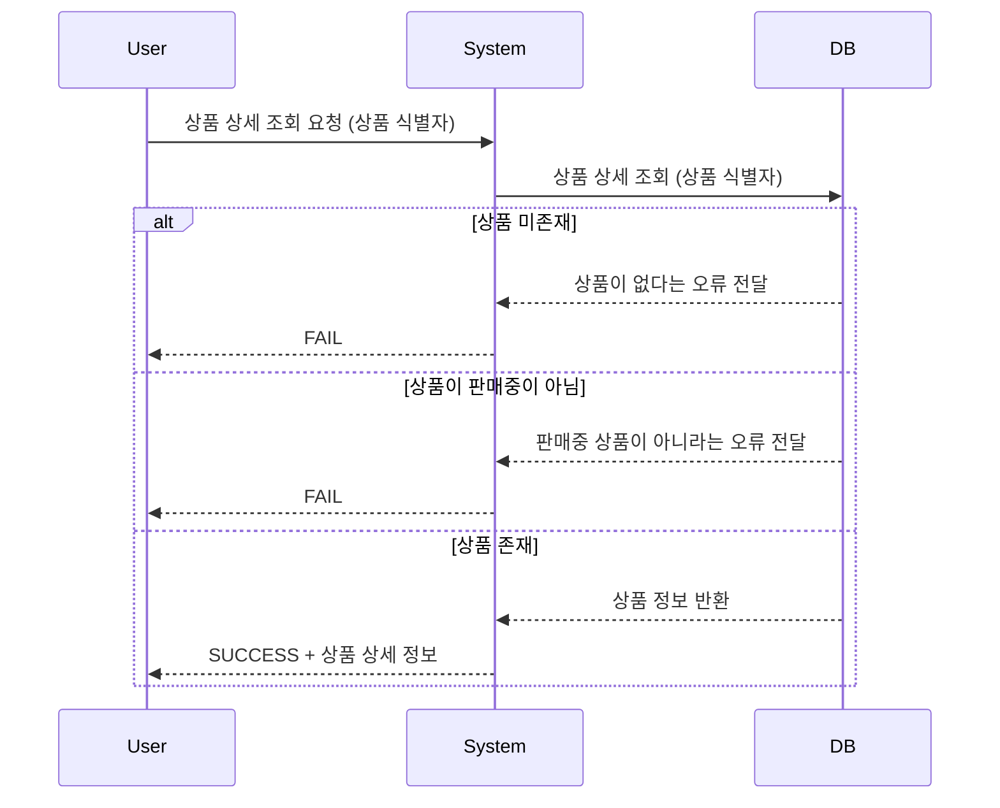
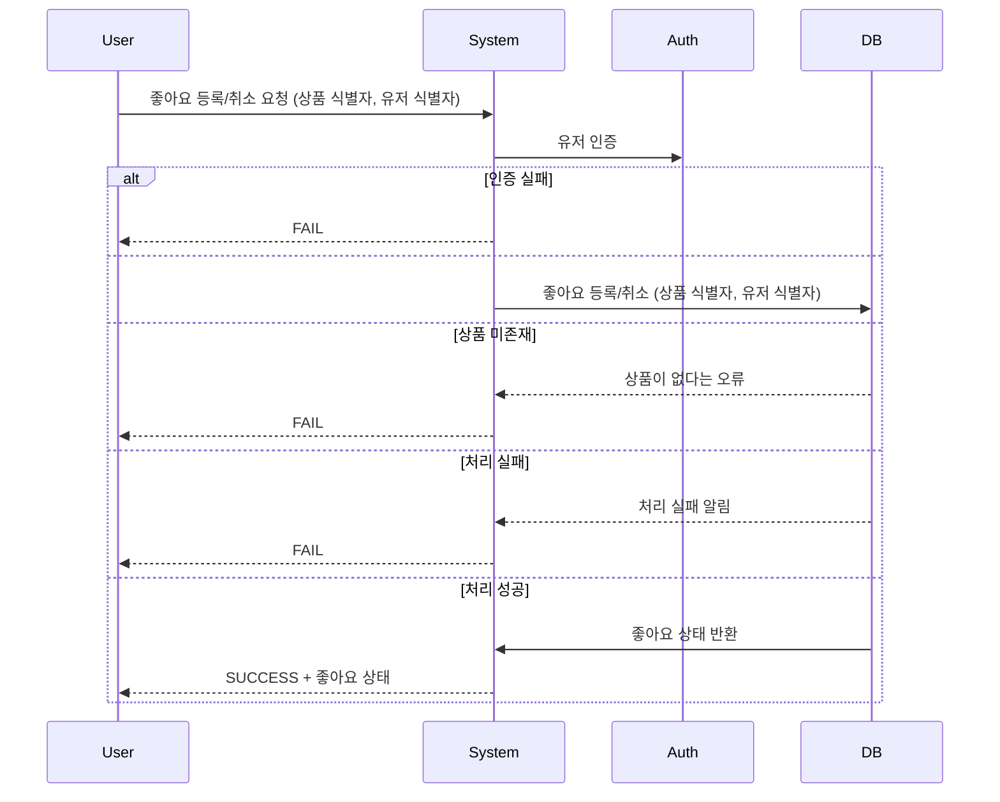
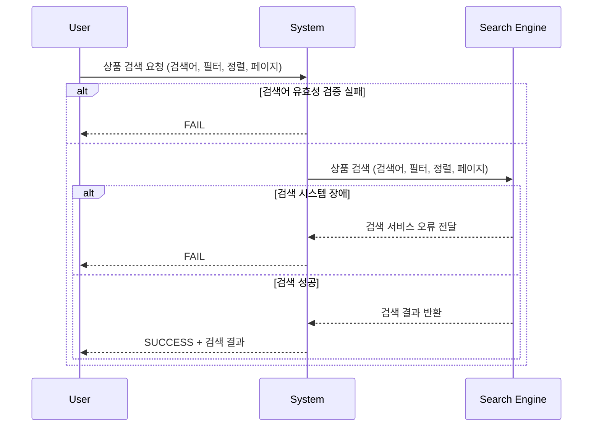
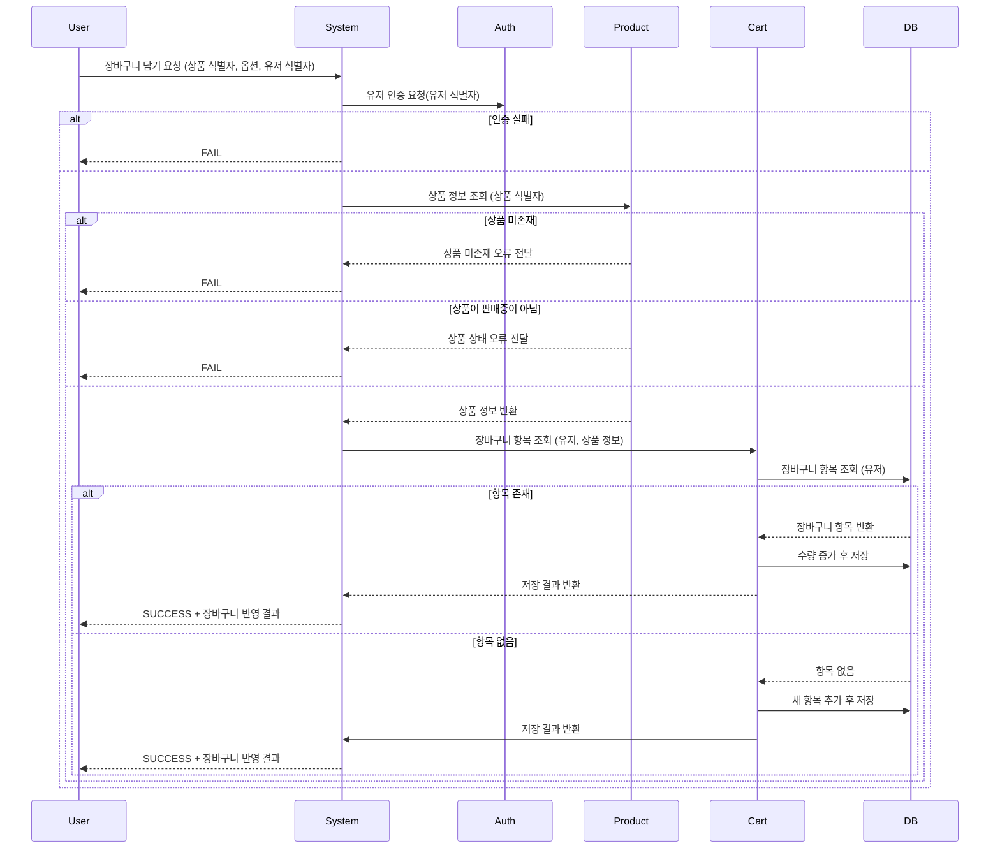
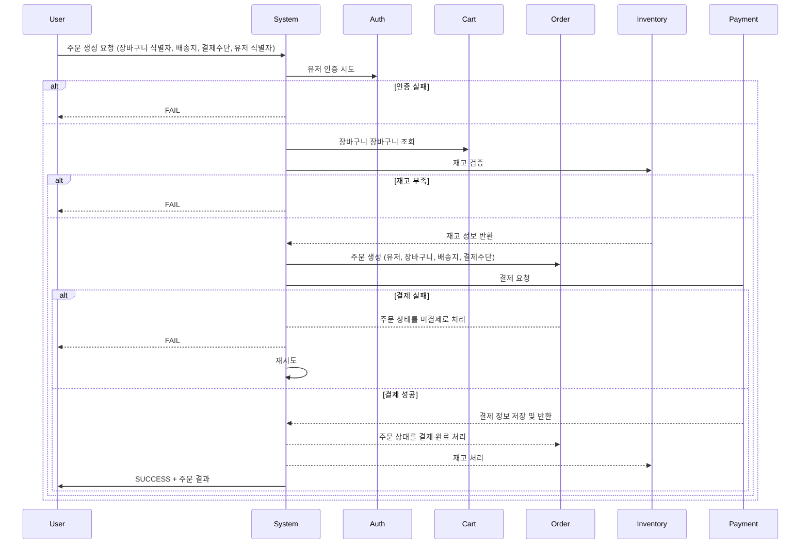

# 시퀀스 다이어그램 (회의용)
> PM, 기획자 등 비개발자 직군들과 함께 회의하기 위해 간소화된 문서입니다.

## 상품 / 브랜드

### 상품 목록 조회

```mermaid
sequenceDiagram
    participant U as User
    participant PS as System
    participant DB as DB

    U->>PS: 상품 목록 조회 요청 (카테고리, 브랜드, 가격대, 정렬)
    
    PS->>DB: 상품 목록 조회 (필터 조건으로 판매중인 상품만)
    
    alt 조회 실패
        DB-->>PS: 상품 조회 중 오류가 발생 전달
        PS-->>U: FAIL + "알 수 없는 이유로 오류 발생했습니다."
    else 조회 성공
        DB-->>PS: 상품 목록 반환
        PS-->>U: SUCCESS + 상품 목록
    end
```

### 상품 정보 조회

```mermaid
sequenceDiagram
    participant U as User
    participant PS as System
    participant DB as DB

    U->>PS: 상품 상세 조회 요청 (상품 식별자)
    
    PS->>DB: 상품 상세 조회 (상품 식별자)
    
    alt 상품 미존재
        DB-->>PS: 상품이 없다는 오류 전달
        PS-->>U: FAIL
    else 상품이 판매중이 아님
        DB-->>PS: 판매중 상품이 아니라는 오류 전달
        PS-->>U: FAIL
    else 상품 존재
        DB-->>PS: 상품 정보 반환
        PS-->>U: SUCCESS + 상품 상세 정보
    end
```

### 상품 좋아요 등록/취소

```mermaid
sequenceDiagram
    participant U as User
    participant PS as System
    participant AT as Auth
    participant DB as DB

    U->>PS: 좋아요 등록/취소 요청 (상품 식별자, 유저 식별자)
    PS->>AT: 유저 인증 
    
    alt 인증 실패
        PS-->>U: FAIL
    else 
    PS->>DB: 좋아요 등록/취소 (상품 식별자, 유저 식별자)
    
    else 상품 미존재
        DB-->>PS: 상품이 없다는 오류
        PS-->>U: FAIL
    else 처리 실패
        DB-->>PS: 처리 실패 알림
        PS-->>U: FAIL
    else 처리 성공
        DB->>PS: 좋아요 상태 반환
        PS-->>U: SUCCESS + 좋아요 상태
    end
```

### 상품 검색

```mermaid
sequenceDiagram
    participant U as User
    participant PS as System
    participant SE as Search Engine

    U->>PS: 상품 검색 요청 (검색어, 필터, 정렬, 페이지)
    
    alt 검색어 유효성 검증 실패
        PS-->>U: FAIL
    else
        PS->>SE: 상품 검색 (검색어, 필터, 정렬, 페이지)
        alt 검색 시스템 장애
            SE-->>PS: 검색 서비스 오류 전달
            PS-->>U: FAIL
        else 검색 성공
            SE-->>PS: 검색 결과 반환
            PS-->>U: SUCCESS + 검색 결과
        end
    end
```

## 장바구니

### 장바구니 담기

```mermaid
sequenceDiagram
    participant U as User
    participant S as System
    participant AS as Auth
    participant PS as Product
    participant CS as Cart
    participant DB as DB
    
    U->>S: 장바구니 담기 요청 (상품 식별자, 옵션, 유저 식별자)
    S->>AS: 유저 인증 요청(유저 식별자)
    
    alt 인증 실패
        S-->>U: FAIL
    else
        S->>PS: 상품 정보 조회 (상품 식별자)
        alt 상품 미존재
            PS-->>S: 상품 미존재 오류 전달
            S-->>U: FAIL
        else 상품이 판매중이 아님
            PS-->>S: 상품 상태 오류 전달
            S-->>U: FAIL
        else
            PS-->>S: 상품 정보 반환
            S->>CS: 장바구니 항목 조회 (유저, 상품 정보)
            CS->>DB: 장바구니 항목 조회 (유저)
            alt 항목 존재
                DB-->>CS: 장바구니 항목 반환
                CS->>DB: 수량 증가 후 저장
                CS-->>S: 저장 결과 반환
                S-->>U: SUCCESS + 장바구니 반영 결과
            else 항목 없음
                DB-->>CS: 항목 없음
                CS->>DB: 새 항목 추가 후 저장
                CS->>S: 저장 결과 반환
                S-->>U: SUCCESS + 장바구니 반영 결과
            end
        end
    end
```

## 주문 / 결제

### 주문 생성

```mermaid
sequenceDiagram
    participant U as User
    participant S as System
    participant A as Auth
    participant C as Cart
    participant O as Order
    participant I as Inventory
    participant P as Payment

    U->>S: 주문 생성 요청 (장바구니 식별자, 배송지, 결제수단, 유저 식별자)
    S->>A: 유저 인증 시도
    
    alt 인증 실패
        S-->>U: FAIL
    else
        S->>C: 장바구니 장바구니 조회
        S->>I: 재고 검증
        alt 재고 부족
            S-->>U: FAIL
        else
            I-->>S: 재고 정보 반환
            S->>O: 주문 생성 (유저, 장바구니, 배송지, 결제수단)
            S->P: 결제 요청
            alt 결제 실패
                S-->O: 주문 상태를 미결제로 처리
                S-->>U: FAIL
                S->>S: 재시도
            else 결제 성공
                P-->>S: 결제 정보 저장 및 반환
                S-->>O: 주문 상태를 결제 완료 처리
                S-->>I: 재고 처리
                S->>U: SUCCESS + 주문 결과
            end
        end
    end
```
